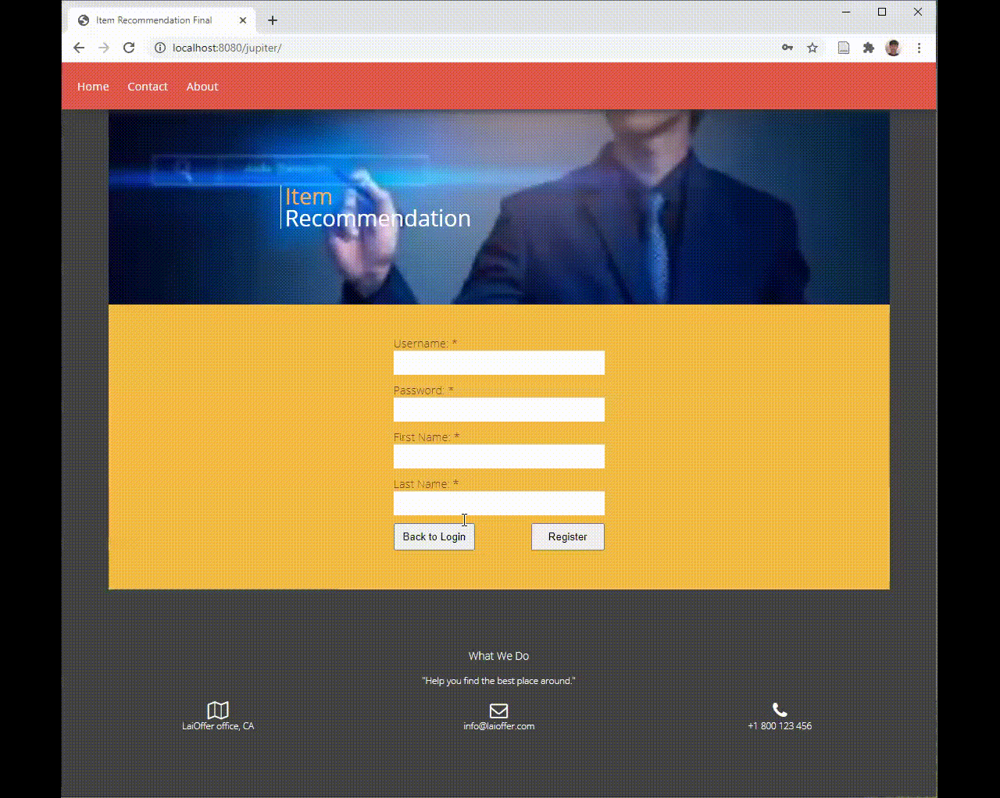

## Job Finder Plus

### Overview
Job plus is a personalized job recommendation engine. It allows users to find posted nearby job from github jobs. User registration is designed to achieve personalized job recomemdation.
  

Item based job recommendation can be made through user's favorite job label. 

### My work at a glance

- Designed and implemented an interactive web app for users to search and apply available job positions.
- Performed front-end web UI design and implementation using HTML/CSS/JavaScript.
- Implemented RESTful APIs using Java servlets, retrieved job descriptions using Github API and stored data in MySQL.
- Explored multiple recommendation algorithms and extracted keywords from job descriptions to implement a Content-based algorithm.
- Deployed the service to AWS EC2

###### Author: Zhao Tang - https://github.com/zt5rice